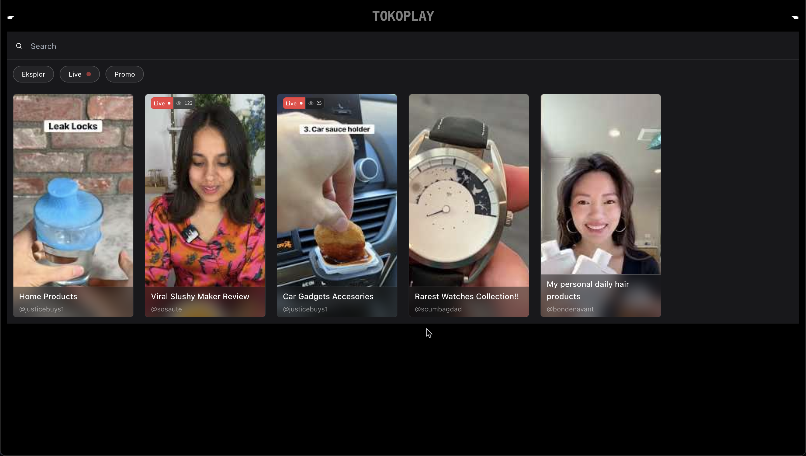

<h1 align="center">Tokoplay</h1>

<h3 align="center">
Tokopedia's Play web app clone as a Gojek's GIGIH 3.0 final term assignment with MERN stack (TypeScript + Papr)
</h3>



# Features

### Search and filter

### Auto-scroll comment

### Optimistic UI

# How to run

1. Clone this repository
2. Run `pnpm install` and `pnpm run dev` on both `/client` and `/server` directory

# API

## Video

```json
{
  id: string,
  image: string,
  category: string,
  channel: string,
  title: string,
  url: string,
  createdAt: string,
}
```

### POST /v1/videos

Create new video

**Request**

- **URL Params**: -
- **Headers**: Content-Type: application/json
- **Body**

```json
{
  "channel": "@sosaute",
  "title": "Viral Slushy Maker Review",
  "url": "https://www.youtube.com/shorts/JQb6dPNh5j8"
}
```

**Response**:

- **201** (OK)

```json
{
  "meta": {
    "status": 201
  }
}
```

- **400** (Bad request)

```json
{
  "meta": {
    "status": 400,
    "message": "Missing required body: channel, title, url"
  }
}
```

### GET /v1/videos

Get all videos

**Request**

- **URL Params**: -
- **Headers**: Content-Type: application/json
- **Body**: -

**Response**:

- **200** (OK)

```json
{
  "meta": {
    "status": 200
  },
  "data": [
    {
      "id": "8nz9e8HOWcM",
      "image": "https://img.youtube.com/vi/8nz9e8HOWcM/0.jpg",
      "category": "Eksplor",
      "createdAt": "2023-08-14T13:03:55.451Z",
      "channel": "@justicebuys1",
      "title": "Home Products",
      "url": "https://www.youtube.com/shorts/8nz9e8HOWcM"
    },
    {
      "id": "JQb6dPNh5j8",
      "image": "https://img.youtube.com/vi/JQb6dPNh5j8/0.jpg",
      "category": "Live",
      "createdAt": "2023-08-14T13:05:42.703Z",
      "channel": "@sosaute",
      "title": "Viral Slushy Maker Review",
      "url": "https://www.youtube.com/shorts/JQb6dPNh5j8"
    }
  ]
}
```

### GET /v1/videos/:videoId

Get video data based on videoId

**Request**

- **URL Params**: videoId (string)
- **Headers**: Content-Type: application/json
- **Body**: -

**Response**:

- **200** (OK)

```json
{
  "meta": {
    "status": 200
  },
  "data": {
    "id": "8nz9e8HOWcM",
    "image": "https://img.youtube.com/vi/8nz9e8HOWcM/0.jpg",
    "category": "Eksplor",
    "createdAt": "2023-08-14T13:03:55.451Z",
    "channel": "@justicebuys1",
    "title": "Home Products",
    "url": "https://www.youtube.com/shorts/8nz9e8HOWcM"
  }
}
```

## Product

```json
{
  id: string,
  videoId: string,
  name: string,
  url: string,
  price: string
  image: string
}
```

### POST /v1/products/:videoId

Create new product based on videoId

**Request**

- **URL Params**: videoId (string)
- **Headers**: Content-Type: application/json
- **Body**

```json
{
  "name": "DIY Slushy Maker Silica Cup Double Layers Cup Smoothie Pinch Ice Cup - Hijau",
  "url": "https://www.tokopedia.com/hongya/diy-slushy-maker-silica-cup-double-layers-cup-smoothie-pinch-ice-cup-hijau-d27e5?extParam=ivf%3Dtrue&src=topads",
  "price": 89900,
  "image": "https://images.tokopedia.net/img/cache/900/VqbcmM/2023/5/17/9a511a1a-46b4-4a22-adfb-c2f269d6c501.jpg"
}
```

**Response**:

- **201** (OK)

```json
{
  "meta": {
    "status": 201
  }
}
```

- **400** (Bad request)

```json
{
  "meta": {
    "status": 400,
    "message": "Missing required body: url, name, price, image"
  }
}
```

### GET /v1/products/:videoId

Get all products based on videoId

**Request**

- **URL Params**: videoId (string)
- **Headers**: Content-Type: application/json
- **Body**: -

**Response**:

- **201** (OK)

```json
{
  "meta": {
    "status": 200
  },
  "data": [
    {
      "id": "S0NHwT1CaJvFzJFGBmRxW",
      "videoId": "8nz9e8HOWcM",
      "name": "DIY Slushy Maker Silica Cup Double Layers Cup Smoothie Pinch Ice Cup - Hijau",
      "url": "https://www.tokopedia.com/hongya/diy-slushy-maker-silica-cup-double-layers-cup-smoothie-pinch-ice-cup-hijau-d27e5?extParam=ivf%3Dtrue&src=topads",
      "price": 89900,
      "image": "https://images.tokopedia.net/img/cache/900/VqbcmM/2023/5/17/9a511a1a-46b4-4a22-adfb-c2f269d6c501.jpg"
    },
    {
      "id": "7dhZdY89X4sWyOG5hWe2O",
      "videoId": "8nz9e8HOWcM",
      "name": "Slushy Cup Ice Cream Maker Frozen Smoothie Squeeze Quick Cooling - Biru",
      "url": "https://www.tokopedia.com/hipu-store/slushy-cup-ice-cream-maker-frozen-smoothie-squeeze-quick-cooling-biru?extParam=ivf%3Dfalse&src=topads",
      "price": 180000,
      "image": "https://images.tokopedia.net/img/cache/900/VqbcmM/2022/8/30/242f08ff-53ce-4725-a49a-71aafad1759f.png"
    }
  ]
}
```

## Comment

```json
{
  id: string,
  videoId: string,
  username: string,
  comment: string,
  createdAt: string,
}
```

### POST /v1/comments/:videoId

Create new comment based on videoId

**Request**

- **URL Params**: videoId (string)
- **Headers**: Content-Type: application/json
- **Body**

```json
{
  "username": "alex",
  "comment": "hahahahhaha"
}
```

**Response**:

- **201** (OK)

```json
{
  "meta": {
    "status": 201
  }
}
```

- **400** (Bad request)

```json
{
  "meta": {
    "status": 400,
    "message": "Missing required body: username, comment"
  }
}
```

### GET /v1/comments/:videoId

Get all comments based on videoId

**Request**

- **URL Params**: videoId (string)
- **Headers**: Content-Type: application/json
- **Body**: -

**Response**:

- **201** (OK)

```json
{
  "meta": {
    "status": 200
  },
  "data": [
    {
      "id": "tgcpkVsdqwzdeN8hQZaVi",
      "createdAt": "2023-08-15T01:38:19.216Z",
      "videoId": "8nz9e8HOWcM",
      "username": "alex",
      "comment": "hahahahhaha"
    },
    {
      "id": "cFNEdSrnicVVXIEu-0XJ8",
      "createdAt": "2023-08-15T01:38:58.293Z",
      "videoId": "8nz9e8HOWcM",
      "username": "oiluz",
      "comment": "kenapa ya?"
    }
  ]
}
```
